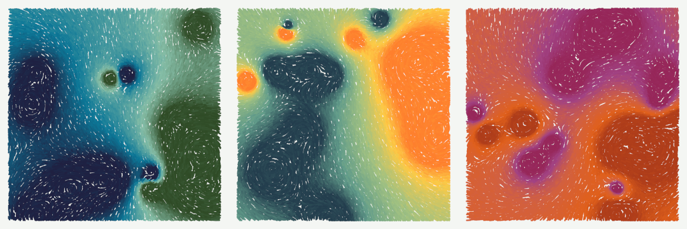

# mag_field
This project draws pretty picture of magnetic fields

# Method
1. Pick a few random positions to place infinitely long wires perpendicular to the image plane.
2. Pick random currents to flow through those wires.
3. Calculate the resulting magnetic field across the image plane.
4. Seperately calculate a similar (magnitude only) field used for color mapping.
5. Generate a list of points to start drawing streamlines from.
6. Sort that list by the colormap value of each startpoint.
7. Render every streamline with a maximum line distance for uniformity.
